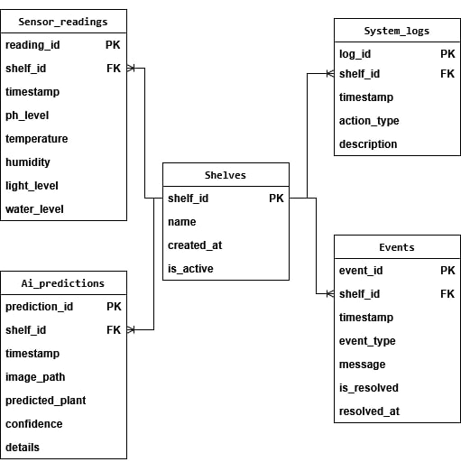

# 1. Таблица `shelves` (Полки)

| Поле | Тип данных | Комментарий |
|------|------------|-------------|
| `shelf_id` | `INTEGER` | Первичный ключ. Уникальный номер полки. Автоматически увеличивается при добавлении новой полки. |
| `name` | `VARCHAR(100)` | Название полки, например "Латук-1" или "Полка с базиликом". Пользователь может менять название. |
| `created_at` | `TIMESTAMP` | Дата и время создания полки. Помогает отслеживать историю. |
| `is_active` | `BOOLEAN` | Флаг активности. Если полку убрали из проекта, мы не удаляем данные, а просто ставим `false`. Данные остаются в истории. |

**Обеспечивает модульность системы. Позволяет добавлять новые полки и архивировать старые, сохраняя все их данные.**

# 2. Таблица `sensor_readings` (Показания датчиков)

| Поле | Тип данных | Комментарий |
|------|------------|-------------|
| `reading_id` | `INTEGER` | Первичный ключ. Уникальный номер каждого показания. |
| `shelf_id` | `INTEGER` | Внешний ключ к таблице `shelves` (`shelf_id`). Показывает, с какой полки пришли данные. |
| `timestamp` | `TIMESTAMP` | Точное время получения данных от `ESP`. Важно для построения графиков изменений. |
| `ph_level` | `FLOAT` | Уровень `pH` (например, 6.5). Может быть `NULL`, если датчика нет. |
| `temperature` | `FLOAT` | Температура в градусах Цельсия (например, 23.5). |
| `humidity` | `FLOAT` | Влажность воздуха в процентах (0-100). |
| `light_level` | `FLOAT` | Уровень освещенности в люксах или условных единицах. |
| `water_level` | `BOOLEAN` | `true`/`false` - достаточно ли воды в баке. |

**Хранит всю телеметрию с датчиков. По этим данным строятся графики в интерфейсе и принимаются решения об автополиве.**

# 3. Таблица `system_logs` (Логи системы)

| Поле | Тип данных | Комментарий |
|------|------------|-------------|
| `log_id` | `INTEGER` | Первичный ключ. Уникальный номер записи в логе. |
| `shelf_id` | `INTEGER` | Внешний ключ к `shelves`. |
| `timestamp` | `TIMESTAMP` | Когда произошло действие. |
| `action_type` | `VARCHAR(50)` | Тип действия. Лучше хранить константами: `PUMP_ON`, `PUMP_OFF`, `LIGHT_ON`, `LIGHT_OFF`, `WATERING_START`, `DATA_RECEIVED`. |
| `description` | `TEXT` | Человекочитаемое описание (например, "Включена помпа `pH`- на 30 секунд"). |

**Аудит системы. Позволяет понять, что делал сервер в любой момент времени. Помогает при отладке: "Почему растение засохло? А, полив не включался 2 дня, вот лог".**

# 4. Таблица `events` (События/Тревоги)

| Поле | Тип данных | Комментарий |
|------|------------|-------------|
| `event_id` | `INTEGER` | Первичный ключ. |
| `shelf_id` | `INTEGER` | Внешний ключ к `shelves`. На какой полке проблема. |
| `timestamp` | `TIMESTAMP` | Когда возникла проблема. |
| `event_type` | `VARCHAR(50)` | Тип события: `PH_LOW`, `PH_HIGH`, `LOW_WATER`, `TEMP_HIGH`, `PUMP_FAILURE`, `AI_ANOMALY`. |
| `message` | `VARCHAR(255)` | Понятное сообщение для пользователя: "Кислотность слишком высокая (`pH`=7.8), нужно добавить `pH`-" |
| `is_resolved` | `BOOLEAN` | Флаг: решена ли проблема. `false` по умолчанию. |
| `resolved_at` | `TIMESTAMP` | Когда проблема была решена. Может быть `NULL`, если еще не решена. |

**Оповещение пользователя о проблемах. Интерфейс показывает активные события (где `is_resolved` = `false`). Можно отправлять уведомления в `Telegram` при появлении новых событий.**

# 5. Таблица `ai_predictions` (Результаты AI)

| Поле | Тип данных | Комментарий |
|------|------------|-------------|
| `prediction_id` | `INTEGER` | Первичный ключ. |
| `shelf_id` | `INTEGER` | Внешний ключ к `shelves`. Какая полка сфотографирована. |
| `timestamp` | `TIMESTAMP` | Время анализа фото. |
| `image_path` | `VARCHAR(255)` | Путь к файлу с фото на диске (например, "/images/2025-03-10/photo_001.jpg"). |
| `predicted_plant` | `VARCHAR(100)` | Результат классификации: "здоровый_латук", "мучнистая_роса", "стадия_роста_2" и т.д. |
| `confidence` | `FLOAT` | Уверенность модели от 0 до 1. Например, 0.95 означает 95% уверенности. |
| `details` | `JSON` | Гибкое поле. Хранит дополнительные данные в формате `JSON`. |

**Хранит результаты работы AI-модели. По этим данным интерфейс показывает статус растений и историю их изменений.**